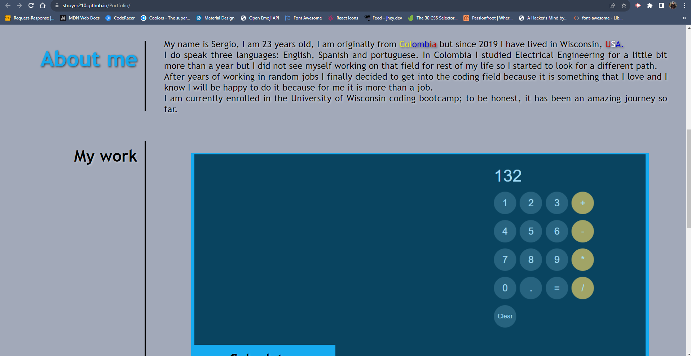

# My Portfolio
 

## Description  :bookmark_tabs:

This was a really good project for me because it made me find a lot of resources and how to use them in my code to make it look nice.
Undoubtedly one of the reasons why I did build this project is because we need a Portfolio when applying to jobs so the employers can see some of our projects and whatnot, and that's why I spent a lot of time making it looks nice. In addition, you can see some of the projects I have worked before. And the most important of all, I learned how to make a website with a lot of CSS code.

## Installation :computer:

You are able to see my project in two different ways, depending on what you are looking for:

 1. If you only want to see the deployed website, you can go to this URL: https://stroyer210.github.io/Portfolio/
 2. If you want to see my code, you have my repository's folder on top, plus all the documents, such HTML, CSS and images.

## Usage :bar_chart:
If you are unable to open the URL, I attached a screenshot of it below:
    
    ---
    
    ---
    
    
As you can see, there is a little menu on the top-right of the website, so you can click any of them and it will take you to the respective section. If you go to my work, you can click on some of the projects I have done and it will take you to the deployed website, and also on the bottom you can find some links so you can contact me.

## Credits :email:

I am gonna list all the links I used to make this project really good.
 - https://getbootstrap.com/docs/5.0/layout/breakpoints/
 - https://github-emoji-picker.rickstaa.dev/
 - https://stackoverflow.com/questions/11701311/logo-image-and-h1-heading-on-the-same-line#:~:text=You%20can%20do%20it%20as,to%20clear%20your%20floating%20elements.&text=This%20is%20my%20code%20without%20any%20div%20within%20the%20header%20tag.
 - https://developer.mozilla.org/en-US/docs/Web/CSS/filter-function/drop-shadow
 - https://www.w3schools.com/css/css_navbar.asp
 - https://www.w3schools.com/css/css3_images.asp
 - https://www.shecodes.io/athena/63010-how-to-add-opacity-to-a-color-in-css#:~:text=To%20add%20opacity%20to%20a%20color%20in%20CSS%2C%20you%20can,to%201%20(completely%20opaque).
 - https://css-tricks.com/almanac/properties/o/object-fit/
 - https://brandon-sweeney.medium.com/how-to-make-images-move-with-css-hover-selector-e56e82c690be
 - https://css-tricks.com/snippets/css/complete-guide-grid/

I also watched a couple videos:
- https://www.youtube.com/watch?v=9XnLMp09_BE
- https://www.youtube.com/watch?v=Qp1FDixrb3Q
- https://www.youtube.com/watch?v=zMB-qfBUIkY

## License :memo:
---
---
MIT License

Copyright (c) 2023 Sergio S. Ardila-Alvarado

Permission is hereby granted, free of charge, to any person obtaining a copy
of this software and associated documentation files (the "Software"), to deal
in the Software without restriction, including without limitation the rights
to use, copy, modify, merge, publish, distribute, sublicense, and/or sell
copies of the Software, and to permit persons to whom the Software is
furnished to do so, subject to the following conditions:

The above copyright notice and this permission notice shall be included in all
copies or substantial portions of the Software.

THE SOFTWARE IS PROVIDED "AS IS", WITHOUT WARRANTY OF ANY KIND, EXPRESS OR
IMPLIED, INCLUDING BUT NOT LIMITED TO THE WARRANTIES OF MERCHANTABILITY,
FITNESS FOR A PARTICULAR PURPOSE AND NONINFRINGEMENT. IN NO EVENT SHALL THE
AUTHORS OR COPYRIGHT HOLDERS BE LIABLE FOR ANY CLAIM, DAMAGES OR OTHER
LIABILITY, WHETHER IN AN ACTION OF CONTRACT, TORT OR OTHERWISE, ARISING FROM,
OUT OF OR IN CONNECTION WITH THE SOFTWARE OR THE USE OR OTHER DEALINGS IN THE
SOFTWARE.

---
---

